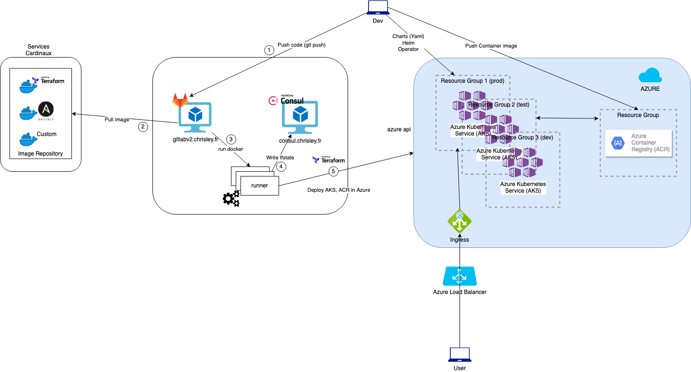

# PoC : Infrastructure as Code to deploy Azure Kubernetes Service (AKS) and Azure Container Registry (ACS) via Terraform and using GitLab CI pipeline

# Presentation
The purpose of this demo is to deploy a Kubernetes Cluster and his Container Registry in Azure by using Azure Kubernetes Service and Azure Registry Container with a CICD pipeline.

# Pain

# Technologies
- Cloud Provider: **Azure Cloud**
- CaaS: **Azure Kubernetes Service (AKS)**
- Container Registry: **Azure Container Registry (ACR)**
- Software managment: **Helm, Charts yaml**
- Tool Chain - CICD: **Git, GitLab, GitLab-CI**
- IaC: **HashiCorp Suite: Terraform, Consul**
- Container: **Docker**
- SC: **DockerHub**

# Script
- CICD: continuous integration and continuous development with an automated GitLab pipeline (on IBM Cloud IaaS). 
- IaC: Terraform + Consul (Hashicorp suite) for infrastructure deployment

# HLD - High Level Diagram

# Author
**Christopher LEY**
SRE and MultiCloud Architect at IBM - IBM Services - christopher.ley@ibm.com
